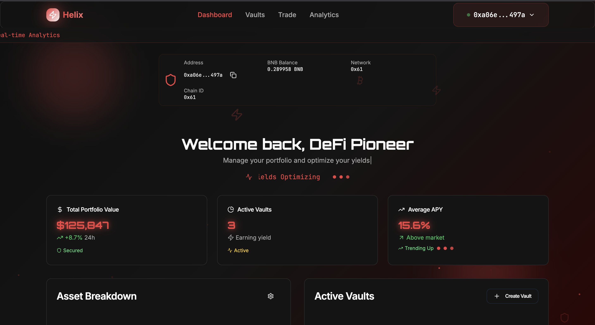

# Helix Frontend

- **Backend Repository**: [https://github.com/vagabond-0/backend-next-js.git](https://github.com/vagabond-0/backend-next-js.git)
- **Smart Contract Repository**: [https://github.com/JijoJohny/Helix-contract.git](https://github.com/JijoJohny/Helix-contract.git)

---

## 🚀 Project Overview

**Helix** is an AI agentic DeFi trading platform built for the BNB Smart Chain. Helix empowers users to:
- Connect their EVM wallets (MetaMask)
- Initialize secure, agent-managed vaults for trading
- Let AI agents trade on their behalf, or receive real-time trading suggestions
- Add custom trading strategies for the agent to execute
- Monitor real-time vault balances, transaction history, and agent performance

### Real-World Scenarios & Market Problems

#### ❌ **Current Problems in DeFi Trading**
- Manual trading is time-consuming and error-prone
- Most users lack the expertise to build and execute complex strategies
- Bots and automation are inaccessible to non-coders
- Market volatility and 24/7 trading make it hard to keep up
- Security and custody risks with third-party bots

#### ✅ **Helix Solution**
- **AI Agentic Automation**: Users initialize a vault, and an AI agent takes over trading, optimizing for yield and risk
- **Custom Strategies**: Users can input their own strategies, which the agent will follow
- **Hybrid Control**: Users can let the agent trade fully autonomously, or receive agent suggestions and execute trades themselves
- **Real-Time Monitoring**: All trades, balances, and agent actions are visible in real time
- **Secure Vaults**: Funds are held in user-specific smart contract vaults, not by the platform
- **No Coding Required**: Anyone can leverage advanced trading automation without writing code

### Typical User Flow
1. **Connect Wallet**: User connects MetaMask (any EVM chain)
2. **Initialize Vault**: User creates a secure vault (secondary address) for agentic trading
3. **Deposit Funds**: User receives funds into the vault (via QR or address)
4. **Agent Takes Over**: AI agent starts trading based on default or user-supplied strategies
5. **User Interaction**: User can monitor, withdraw, or override agent with manual trades or new strategies
6. **Transparency**: All actions, trades, and balances are visible in the dashboard

---

## 🖼️ UI Preview




---

## 🏗️ Architecture

```
+-------------------+        +-------------------+        +-------------------+
|    Frontend (UI)  | <----> |     Backend API   | <----> |   Smart Contracts |
|  (ReactJs, Vite)  |        |       (NextJs)    |        |   (Solidity, BSC) |
+-------------------+        +-------------------+        +-------------------+
```


- **Frontend**: User interface, wallet connection, vault management, agent interaction, QR code, and real-time updates
- **Backend**: User/session management, agent orchestration, vault creation, trading logic, API for wallet operations
- **Smart Contracts**: Vault logic, fund custody, on-chain trading, agent execution (BNB Chain)

---

## 📝 Features
- AI agentic trading automation
- User-defined trading strategies
- MetaMask wallet connect (any EVM chain)
- Vault initialization (secondary address)
- Receive funds (QR code, copy address)
- Withdraw funds (to any address)
- Real-time vault balance (BNB)
- Transaction feedback (hash, block number)
- Responsive, modern UI (Tailwind, glassmorphism)

---

## 🛠️ Getting Started

### Prerequisites
- Node.js (v18+ recommended)
- Yarn or npm
- MetaMask extension

### Installation
```bash
git clone https://github.com/AmitStredz/helix-frontend.git
cd helix-frontend
npm install # or yarn install
```

### Running Locally
```bash
npm run dev # or yarn dev
```
- The app will be available at [http://localhost:8080](http://localhost:8080)
- Make sure your backend is running and accessible (see backend repo)

---

## 🔗 Backend & Smart Contract Links
- **Backend API**: [https://github.com/vagabond-0/backend-next-js.git](https://github.com/vagabond-0/backend-next-js.git)
- **Smart Contracts**: [https://github.com/JijoJohny/Helix-contract.git](https://github.com/JijoJohny/Helix-contract.git)

---

## 📚 Guides

### 1. Connect Wallet
- Click "Connect Wallet" in the navbar
- Approve connection in MetaMask

### 2. Initialize Vault
- If not connected, click "Initialize Vault"
- Wait for secondary address assignment
- Copy or scan the vault address to receive funds

### 3. Receive Funds
- Use the QR code or copy the vault address
- Send BNB or tokens to your vault

### 4. Agentic Trading
- Once funds are in the vault, the AI agent will begin trading automatically
- You can add your own strategies for the agent to follow
- Optionally, review and approve agent suggestions before execution

### 5. Withdraw Funds
- Enter amount and recipient address
- Confirm withdrawal
- View transaction hash and block number

---

## 🤝 Contributing
Pull requests are welcome! For major changes, please open an issue first to discuss what you would like to change.