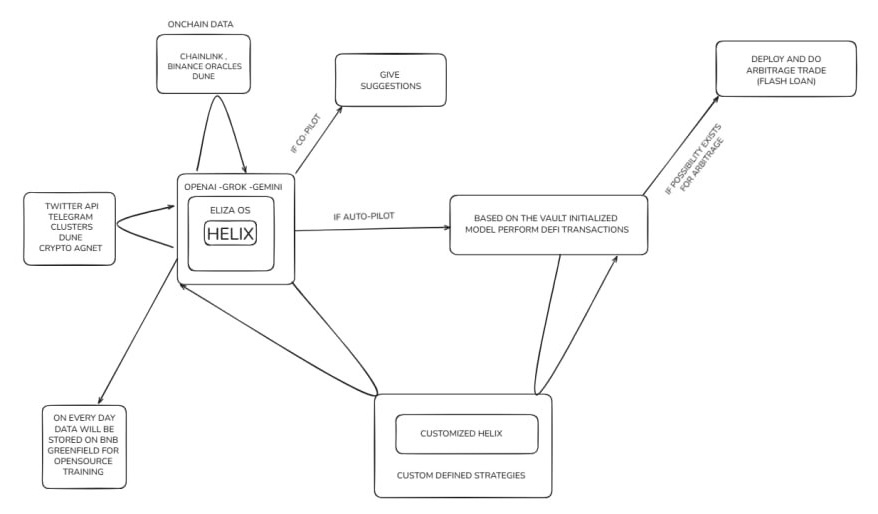

# Helix Frontend

- **Backend Repository**: [https://github.com/vagabond-0/backend-next-js.git](https://github.com/vagabond-0/backend-next-js.git)
- **Smart Contract Repository**: [https://github.com/JijoJohny/Helix-contract.git](https://github.com/JijoJohny/Helix-contract.git)
---

## 🚀 Project Overview

**Helix** is a modern, full-stack DeFi vault management platform. This frontend (React + TypeScript + Vite + Tailwind) enables users to:
- Connect any EVM wallet (MetaMask)
- Initialize secure vaults (with secondary addresses)
- Deposit/receive and withdraw funds
- View real-time vault balances and transaction history
- Interact with a robust backend and smart contracts on BNB Smart Chain (Testnet/Mainnet)

---

## 🏗️ Architecture

```
+-------------------+        +-------------------+        +-------------------+
|    Frontend (UI)  | <----> |     Backend API   | <----> |   Smart Contracts |
|  (React, Vite)    |        |  (Node.js/Express)|        |   (Solidity, BSC) |
+-------------------+        +-------------------+        +-------------------+
```



- **Frontend**: User interface, wallet connection, vault management, QR code, and real-time updates
- **Backend**: User/session management, vault creation, transaction orchestration, API for wallet operations
- **Smart Contracts**: Vault logic, fund custody, on-chain operations (BNB Chain)

---

## 📝 Features
- MetaMask wallet connect (any EVM chain)
- Vault initialization (secondary address)
- Receive funds (QR code, copy address)
- Withdraw funds (to any address)
- Real-time vault balance (BNB)
- Transaction feedback (hash, block number)
- Responsive, modern UI (Tailwind, glassmorphism)

---

## 🛠️ Getting Started

### Prerequisites
- Node.js (v18+ recommended)
- Yarn or npm
- MetaMask extension

### Installation
```bash
git clone https://github.com/AmitStredz/helix-frontend.git
cd helix-frontend
npm install # or yarn install
```

### Running Locally
```bash
npm run dev # or yarn dev
```

- The app will be available at [http://localhost:8080](http://localhost:8080)
- Make sure your backend is running and accessible (see backend repo)

---

## 🔗 Backend & Smart Contract Links
- **Backend API**: [https://github.com/vagabond-0/backend-next-js.git](https://github.com/vagabond-0/backend-next-js.git)
- **Smart Contracts**: [https://github.com/JijoJohny/Helix-contract.git](https://github.com/JijoJohny/Helix-contract.git)

---

## 📚 Guides

### 1. Connect Wallet
- Click "Connect Wallet" in the navbar
- Approve connection in MetaMask

### 2. Initialize Vault
- If not connected, click "Initialize Vault"
- Wait for secondary address assignment
- Copy or scan the vault address to receive funds

### 3. Receive Funds
- Use the QR code or copy the vault address
- Send BNB or tokens to your vault

### 4. Withdraw Funds
- Enter amount and recipient address
- Confirm withdrawal
- View transaction hash and block number

---

## 🖼️ UI Preview


---

## 🤝 Contributing
Pull requests are welcome! For major changes, please open an issue first to discuss what you would like to change.

---